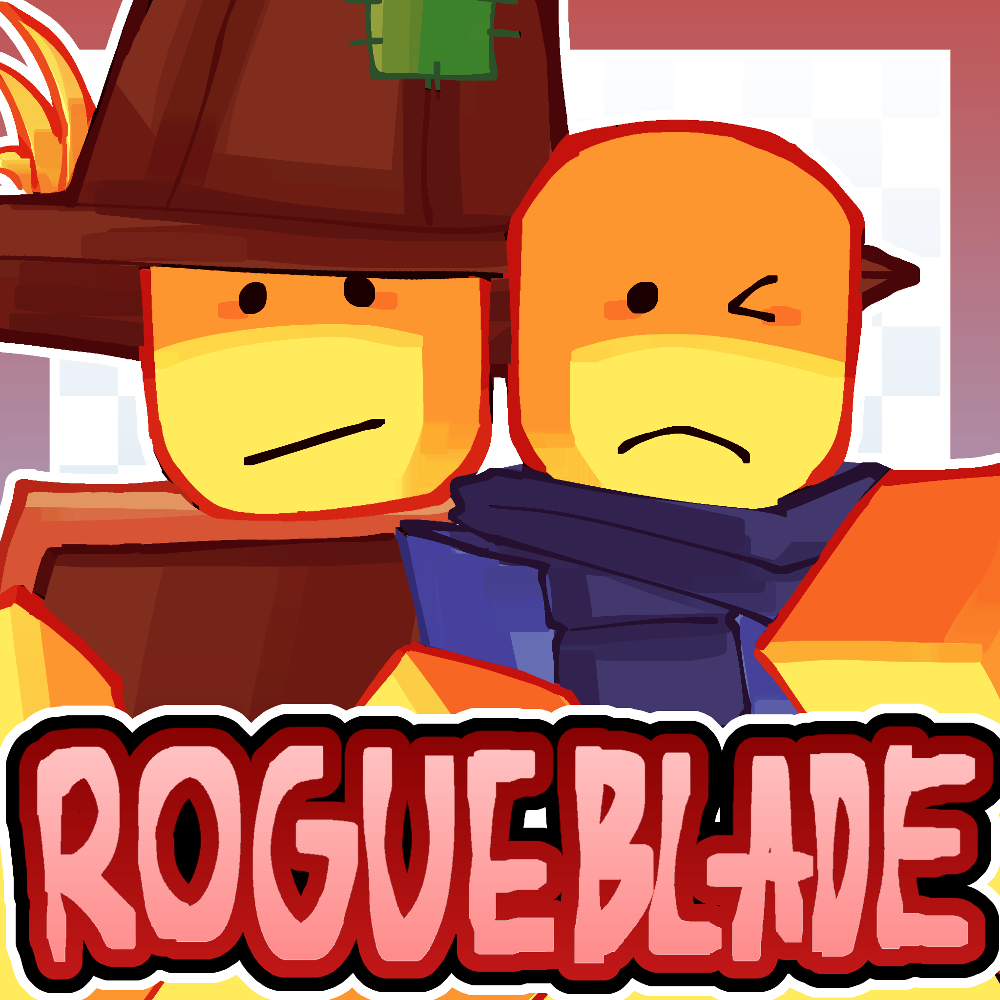

# 🗡️ RogueBlade Wiki

> ⚠️ **Unofficial.** This wiki is community-maintained and is **not** affiliated with or endorsed by the developers of RogueBlade. Info reflects the current live version and may lag behind recent patches.

Welcome to the **unofficial RogueBlade wiki** — your reference for classes, weapons, items, enemies, biomes, and everything in between.

[**▶️ Play RogueBlade on Roblox**](https://www.roblox.com/games/13141106123/RogueBlade)

## 🎮 The game

**RogueBlade** is a co-op roguelite built for **3–4 players**. Fight through procedurally ordered biomes, buy items between waves, unlock classes with blood earned from previous runs, and chain synergies until you're strong enough to survive Nightmare mode.

Inspired by:

- 🎲 [Randomly Generated Droids](https://www.roblox.com/games/2474473625/Randomly-Generated-Droids)
- 😈 [The Binding of Isaac](https://bindingofisaac.com/)
- 🌧️ [Risk of Rain](https://riskofrain.com/)

## 🧭 Jump to

- 🎮 **[Getting Started](getting-started/how-to-play.md)** — controls, basic mechanics, how co-op works
- 🎭 **[Classes](classes/README.md)** — all 29 playable classes with stats, skills and masteries
- ⚙️ **[Mechanics](mechanics/stats.md)** — stats, defense, mana, debuffs, rituals, skills
- ⚔️ **[Weapons](weapons/README.md)** — swords, staffs, books, slingshots, shields
- 🎒 **[Items](items/README.md)** — artifacts, rings, rituals, coils
- 👑 **[Bosses](bosses/README.md)** — every major boss from Chief Telamon to Pluto

## 🤝 Contributing

Found an error, outdated info, or a missing page? Pull requests and issues are welcome on the [**GitHub repository**](https://github.com/Serokai/rogueblade-wiki).
